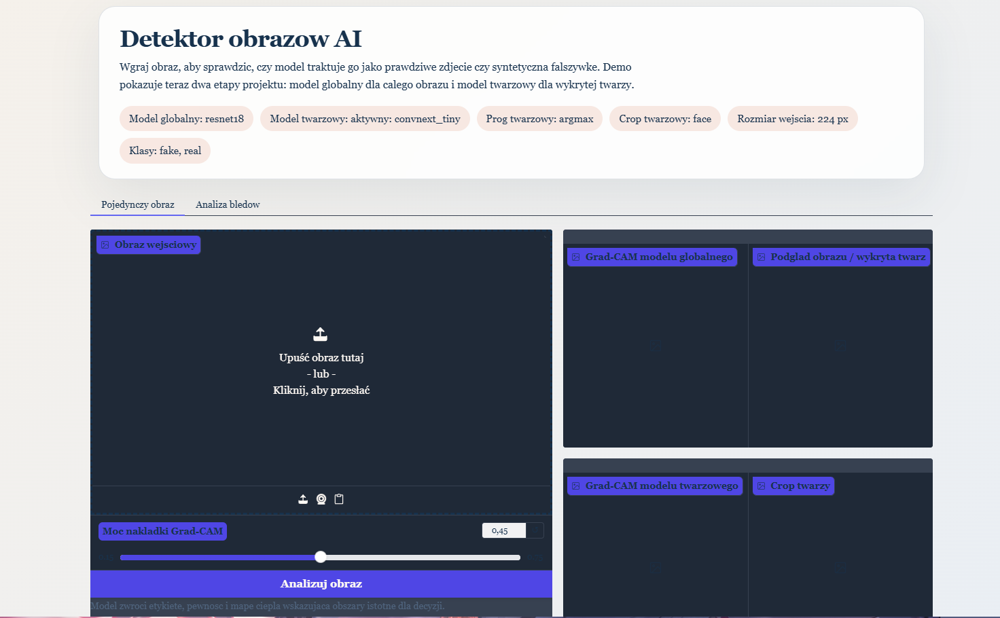

# Wykrywanie Obrazów Generowanych Przez AI

Projekt dotyczy wykrywania, czy obraz jest prawdziwym zdjęciem, czy został wygenerowany przez model AI. Repo zawiera już domknięty baseline `real vs fake`, a dodatkowo jest przygotowane pod osobny etap twarzowy / deepfake oparty o cropy twarzy.

## Aktualny Stan

- Działa trening klasyfikatora `real` / `fake`.
- Działa wznowienie treningu z checkpointu.
- Działa Grad-CAM dla pojedynczych obrazów.
- Działa lokalne demo webowe w Gradio.
- Działa test odporności na spadek jakości obrazu.
- Działa preprocessing datasetu twarzy z automatycznym cropowaniem.
- Jest gotowa konfiguracja treningu osobnego modelu twarzowego.
- Działa benchmark porównujący model globalny i model twarzowy na portretach.
- Domyślny aktualny checkpoint modelu twarzowego do demo to `models/faces_convnext_v2_adapt/best_model.pt`.
- Gotowa dokumentacja LaTeX znajduje się w katalogu `dokumentacja/`.

## Podgląd Działania

Ekran startowy lokalnego interfejsu demonstracyjnego:



Przykład poprawnej klasyfikacji obrazu wygenerowanego przez AI:


Przykład działania etapu twarzowego:


Przykład wizualizacji Grad-CAM:


## Najważniejsze Wyniki

Najlepszy dotychczasowy baseline na zbiorze testowym:

- `accuracy=0.9339`
- `f1_macro=0.9339`
- `roc_auc=0.9831`

W nowszym treningu z mocniejszymi augmentacjami odpornościowymi model uzyskał:

- `accuracy=0.9268`
- `f1_macro=0.9267`
- `roc_auc=0.9804`

Ten drugi wariant jest nieco słabszy na "czystym" teście, ale lepiej nadaje się do badań odporności na kompresję i degradację obrazu.

## Podsumowanie Eksperymentów

Dwa najważniejsze przebiegi treningu na etapie `real vs ai`:

| Wariant | Charakterystyka | Accuracy | F1 Macro | ROC-AUC |
| --- | --- | ---: | ---: | ---: |
| Baseline | model ogólny, lżejsze augmentacje | 0.9339 | 0.9339 | 0.9831 |
| Robust | mocniejsze augmentacje jakościowe | 0.9268 | 0.9267 | 0.9804 |

Wniosek praktyczny:

- baseline daje lepszy wynik na "czystym" teście,
- wariant `robust` lepiej nadaje się do analizy odporności na JPEG, blur i downscale,
- do pracy raportowej warto zachować oba wyniki, bo razem dobrze pokazują trade-off między skutecznością i odpornością.

Syntetyczne podsumowanie etapu znajduje się też w `reports/PODSUMOWANIE_REAL_VS_AI.md`.

## Dokumentacja Projektowa

Źródła dokumentacji są w katalogu `dokumentacja/`, główny plik to `dokumentacja/dokument.tex`, a aktualny PDF to `dokumentacja/dokument.pdf`.
Zrzuty ekranu i rysunki użyte w pracy znajdują się w `dokumentacja/rys/`.

Aby przebudować dokument:

```bash
cd dokumentacja
latexmk -pdf dokument.tex
```

## Model

Obecny baseline korzysta z klasyfikatora obrazu zbudowanego na `timm`.

- architektura domyślna: `resnet18`
- wagi startowe: `pretrained=true`
- rozmiar wejścia: `224x224`
- klasy wyjściowe: `fake`, `real`
- typ zadania: klasyfikacja całego obrazu, nie osobnej twarzy

To oznacza, że model patrzy na cały kadr i uczy się globalnych cech obrazu, a nie tylko obszaru twarzy. Z tego powodu dobrze nadaje się jako pierwszy baseline `real vs ai`, ale nie powinien jeszcze być traktowany jako docelowy detektor deepfake.

Najważniejsze cechy treningu:

- loss: `CrossEntropyLoss`
- optimizer: `AdamW`
- metryka wyboru najlepszego checkpointu: `ROC-AUC` dla klasy `fake`
- wspierane wznowienie treningu z checkpointu
- wspierany `AMP` na GPU

Szczegóły ostatniego treningu są zapisywane w `models/training_summary.json`.

## Ograniczenia Modelu

Model najlepiej radzi sobie ze zdjęciami fotograficznymi dobrej jakości. Wyniki mogą być mniej wiarygodne dla:

- zdjęć mocno skompresowanych przez komunikatory, np. Messenger,
- obrazów rozmytych lub o niskiej rozdzielczości,
- portretów niskiej jakości,
- ilustracji, anime i kadrów animowanych,
- danych spoza rozkładu treningowego.

Predykcje modelu należy traktować jako wsparcie analityczne, a nie niepodważalny dowód.

## Struktura Danych

Aktualny pipeline oczekuje danych w strukturze:

```text
data/real_vs_ai/
  train/
    fake/
    real/
  val/
    fake/
    real/
  test/
    fake/
    real/
```

Etap twarzowy korzysta z dwóch struktur danych:

```text
data/deepfake_faces/
  train/
    fake/
    real/
  val/
    fake/
    real/
  test/
    fake/
    real/
```

To są oryginalne portrety lub klatki, z których będą wycinane twarze.

Po preprocessingu powstaje osobny dataset cropów:

```text
data/deepfake_faces_crops/
  train/
    fake/
    real/
  val/
    fake/
    real/
  test/
    fake/
    real/
```

Nowy, mocniejszy eksperyment `ConvNeXt v2` może korzystać z curated miksu wieloźródłowego:

```text
data/deepfake_faces_v2/
  train/
    fake/
    real/
  val/
    fake/
    real/
  test/
    fake/
    real/
```

## Szybki Start

1. Instalacja zależności:

```bash
pip install -r requirements.txt
```

Na Windows `requirements.txt` instaluje domyślnie build PyTorch z CUDA 12.8, żeby trening mógł korzystać z GPU NVIDIA zamiast wersji CPU-only.

2. Przygotowanie `val/`, jeśli dataset ma tylko `train/` i `test/`:

```bash
python -m src.split_dataset --input-dir data/real_vs_ai --layout pre_split --val-from-train 0.15
```

3. Trening:

```bash
python -m src.train --config config.yaml
```

4. Wznowienie treningu:

```bash
python -m src.train --config config.yaml --resume models/last_checkpoint.pt
```

5. Predykcja dla jednego obrazu:

```bash
python -m src.predict --checkpoint models/best_model.pt --image path/to/image.jpg
```

6. Zapisanie mapy Grad-CAM:

```bash
python -m src.predict --checkpoint models/best_model.pt --image path/to/image.jpg --save-cam reports/gradcam_example.jpg
```

7. Test odporności na pogorszenie jakości obrazu:

```bash
python -m src.robustness_eval --checkpoint models/best_model.pt
```

Raport zapisze się domyślnie do `reports/robustness_eval.json`.

## Etap Twarzowy

1. Przygotowanie cropów twarzy z surowego datasetu portretów:

```bash
python -m src.deepfake_faces prepare-dataset --input-dir data/deepfake_faces --output-dir data/deepfake_faces_crops
```

Domyślnie skrypt zachowuje tylko największą twarz na obrazie, dodaje margines wokół bboxu i zapisuje manifest do `data/deepfake_faces_crops/face_dataset_manifest.json`.
Możesz też przygotować szersze cropy portretowe:

```bash
python -m src.deepfake_faces prepare-dataset --input-dir data/deepfake_faces --output-dir data/deepfake_portraits --crop-style portrait
```

2. Analiza pojedynczego obrazu z wykryciem twarzy:

```bash
python -m src.deepfake_faces --checkpoint models/best_model.pt --image path/to/portrait.jpg --save-annotated-image reports/faces_preview.jpg
```

Komenda działa też w trybie jawnym:

```bash
python -m src.deepfake_faces inspect --checkpoint models/best_model.pt --image path/to/portrait.jpg
```

3. Trening osobnego modelu twarzowego:

```bash
python -m src.train --config config_faces.yaml
```

Aktualna konfiguracja twarzowa korzysta z `convnext_tiny`.
Checkpointy i podsumowanie treningu dla starszej konfiguracji zapiszą się domyślnie do `models/faces_convnext/`.
W aktualnych eksperymentach używany jest jednak nowszy wariant `ConvNeXt v2`, którego bazowy checkpoint znajduje się w `models/faces_convnext_v2/`, a checkpoint po adaptacji w `models/faces_convnext_v2_adapt/`.

3a. Złożenie curated datasetu `ConvNeXt v2` z dużego, różnorodnego zbioru:

Najpierw umieść wybrane źródła pod katalogiem `data/multisource_raw/`, zgodnie z plikiem
`curated_faces_v2_sources.yaml`, a potem uruchom:

```bash
python -m src.prepare_curated_face_dataset --spec curated_faces_v2_sources.yaml --copy
```

Domyślnie skrypt składa kontrolowany miks z:
- `FFHQ`
- `Multiface`
- `140k-real-vs-fake`
- `Deep-vs-Real`
- `deepfake-vs-real-60k`
- `stable_diffusion`
- `dalle-generated`
- `real-vs-hardfakes`

Wynik trafi do `data/deepfake_faces_v2/`, a pełny manifest do
`data/deepfake_faces_v2/curated_dataset_manifest.json`.

3b. Trening `ConvNeXt v2` na curated miksie:

```bash
python -m src.train --config config_faces_v2.yaml
```

Checkpointy zapiszą się do `models/faces_convnext_v2/`.

4. Porównanie modelu globalnego i twarzowego na portretach:

```bash
python -m src.compare_face_models --global-checkpoint models/best_model.pt --face-checkpoint models/faces_convnext_v2/best_model.pt --data-dir data/deepfake_faces --split test
```

Raport porównawczy zapisze się domyślnie do `reports/face_model_comparison.json`, a pełny CSV obok niego.
Do eksperymentu z szerszym cropem portretowym można użyć:

```bash
python -m src.compare_face_models --global-checkpoint models/best_model.pt --face-checkpoint models/faces_convnext_v2/best_model.pt --data-dir data/deepfake_faces --split test --crop-style portrait
```

5. Przygotowanie małego datasetu adaptacyjnego `hard fakes + old real`:

```bash
python -m src.prepare_adaptation_dataset --fake-dir data/new_dataset/hard_fakes --real-dir data/deepfake_faces_crops/train/real --output-dir data/hard_fakes_adaptation --copy
```

Domyślnie skrypt przygotuje:
- `train/fake=500`, `val/fake=100`, `test/fake=100`
- `train/real=1000`, `val/real=200`, `test/real=200`

Wszystkie przypisania zapisze też do `adaptation_manifest.json`.

6. Fine-tuning modelu twarzowego na `hard fakes`:

```bash
python -m src.train --config config_hard_fakes.yaml --init-checkpoint models/faces_convnext_v2/best_model.pt
```

Ta komenda startuje od wag najlepszego modelu twarzowego, ale nie przenosi historii, optimizera ani starego `best_val_score`, więc nadaje się do czystego eksperymentu adaptacyjnego.
Checkpoint tego opcjonalnego wariantu zapisze się do `models/faces_convnext_hard_adapt/`.

7. Strojenie progu decyzyjnego dla modelu adaptacyjnego:

```bash
python -m src.tune_threshold --checkpoint models/faces_convnext_hard_adapt/best_model.pt --config config_hard_fakes.yaml --tune-split val --eval-split test --metric f1_positive
```

Skrypt zapisze raport do `reports/threshold_tuning/` i poda najlepszy próg dla klasy `fake`.

8. Użycie progu w predykcji lub GUI:

```bash
python -m src.predict --checkpoint models/faces_convnext_hard_adapt/best_model.pt --image path/to/image.jpg --threshold 0.62
```

```bash
python -m src.web_demo --checkpoint models/best_model.pt --face-checkpoint models/faces_convnext_hard_adapt/best_model.pt --face-threshold 0.62
```

9. Przygotowanie zewnętrznego benchmarku Gemini:

```bash
python -m src.prepare_gemini_benchmark --fake-dir data/gemini_benchmark_sources/fake --real-dir data/gemini_benchmark_sources/real --output-dir data/gemini_benchmark --copy
```

Domyślnie skrypt zbuduje split `test/` i dobierze tyle samo `real`, ile dostępnych `fake`.

10. Ewaluacja na benchmarku Gemini:

```bash
python -m src.error_analysis --checkpoint models/best_model.pt --config config_gemini_benchmark.yaml --split test --output-dir reports/gemini_global
```

```bash
python -m src.compare_face_models --global-checkpoint models/best_model.pt --face-checkpoint models/faces_convnext_v2_adapt/best_model.pt --data-dir data/gemini_benchmark --split test --crop-style portrait --output-path reports/gemini_face_vs_global.json
```

## Pilotowy Benchmark OOD

Jeśli chcesz szybko sprawdzić, czy model gubi najnowsze generatory bez ręcznego budowania dużego datasetu, w repo jest przygotowany mały workflow pilota:

1. Gotowa pula promptów startowych:

```text
pilot_ood_prompt_pool.csv
```

2. Prosty arkusz do odhaczania próbek:

```text
pilot_ood_samples_template.csv
```

3. Domyślna struktura surowych folderów:

```text
data/ood_sources/
  gpt_fake/
  nano2_fake/
  real_matched/
```

4. Domyślna specyfikacja pilota:

```text
pilot_ood_benchmark_sources.yaml
```

Domyślnie pilot składa benchmark `test` z:
- `gpt_fake=20`
- `nano2_fake=20`
- `real_matched=40`

5. Złożenie benchmarku jedną komendą:

```bash
python -m src.prepare_ood_benchmark --spec pilot_ood_benchmark_sources.yaml --copy
```

Wynik trafi do:

```text
data/ood_pilot_benchmark/
  test/
    fake/
    real/
```

Skrypt zapisze też manifest do:

```text
data/ood_pilot_benchmark/ood_benchmark_manifest.json
```

Nazwy eksportowanych plików zachowują prefiks źródła, np. `gpt__...` albo `nano2__...`, więc po ewaluacji łatwo policzyć wyniki per generator.

6. Ewaluacja modelu globalnego na pilocie:

```bash
python -m src.error_analysis --checkpoint models/best_model.pt --config config_gemini_benchmark.yaml --data-dir data/ood_pilot_benchmark --split test --output-dir reports/ood_pilot_global
```

7. Porównanie modelu globalnego i twarzowego:

```bash
python -m src.compare_face_models --global-checkpoint models/best_model.pt --face-checkpoint models/faces_convnext_v2_adapt/best_model.pt --data-dir data/ood_pilot_benchmark --split test --crop-style portrait --output-path reports/ood_pilot_face_vs_global.json
```

## Opcja A: Adaptacja Modelu Globalnego

Jeśli chcesz szybko pokazać postęp na nowych generatorach, najprostsza ścieżka to dostrojenie modelu globalnego na nowych `GPT/Nano2 + real`, ale bez naruszania zamrożonego benchmarku `ood_pilot_benchmark`.

1. Zostaw `data/ood_pilot_benchmark/` tylko do finalnej ewaluacji.

2. Zbierz osobny surowy materiał adaptacyjny do:

```text
data/global_adaptation_sources/
  gpt_fake/
  nano2_fake/
  real_matched/
```

To powinny być nowe obrazy, inne niż te użyte w `ood_pilot_benchmark`.

3. Specyfikacja adaptacji jest gotowa w:

```text
global_adaptation_sources.yaml
```

Domyślnie łączy:
- nowe `gpt_fake`
- nowe `nano2_fake`
- nowe `real_matched`
- ograniczoną domieszkę starego `legacy_fake` z `data/real_vs_ai/train/fake`
- ograniczoną domieszkę starego `legacy_real` z `data/real_vs_ai/train/real`

4. Złożenie datasetu adaptacyjnego:

```bash
python -m src.prepare_global_adaptation_dataset --spec global_adaptation_sources.yaml --copy
```

Wynik trafi do:

```text
data/global_adaptation/
  train/
    fake/
    real/
  val/
    fake/
    real/
  test/
    fake/
    real/
```

5. Gotowy config fine-tuningu:

```text
config_global_adaptation.yaml
```

6. Fine-tuning modelu globalnego od istniejącego checkpointu:

```bash
python -m src.train --config config_global_adaptation.yaml --init-checkpoint models/best_model.pt
```

Checkpoint adaptacyjny zapisze się domyślnie do:

```text
models/global_ood_adapt/
```

7. Opcjonalne strojenie progu dla nowego modelu:

```bash
python -m src.tune_threshold --checkpoint models/global_ood_adapt/best_model.pt --config config_global_adaptation.yaml --tune-split val --eval-split test --metric f1_positive
```

8. Finalna ewaluacja na zamrozonym benchmarku pilota:

```bash
python -m src.error_analysis --checkpoint models/global_ood_adapt/best_model.pt --config config_gemini_benchmark.yaml --data-dir data/ood_pilot_benchmark --split test --output-dir reports/ood_pilot_global_adapted
```

Jeśli po strojeniu progu chcesz użyć konkretnej wartości dla klasy `fake`, możesz potem podać ją jawnie w `src.predict` albo `src.web_demo` przez `--threshold`.

## Kolejny Krok: Adaptacja Modelu Twarzowego

Jeśli po etapie diagnostycznym uznasz, że głównym kierunkiem rozwoju powinien być model twarzowy, repo ma teraz też gotowy workflow pod ten wariant.

1. Zbierz surowe portrety do:

```text
data/face_adaptation_sources_raw/
  fake/
  real/
```

To powinny być nowe obrazy `GPT/Nano2 + real`, inne niż benchmark testowy.

2. Wytnij twarze do osobnego katalogu cropów:

```bash
python -m src.deepfake_faces prepare-dataset --input-dir data/face_adaptation_sources_raw --output-dir data/face_adaptation_sources_crops --crop-style face
```

Jeśli chcesz porównać szersze ujęcia, możesz zamiast tego użyć `--crop-style portrait`, ale najczystszy pierwszy eksperyment adaptacyjny warto zrobić na `face`.

3. Specyfikacja miksu adaptacyjnego:

```text
face_adaptation_sources.yaml
```

Domyślnie łączy:
- nowe cropy `fake` z `data/face_adaptation_sources_crops/fake`
- nowe cropy `real` z `data/face_adaptation_sources_crops/real`
- domieszkę starszych danych z `data/deepfake_faces_v2/train`

4. Złożenie datasetu adaptacyjnego:

```bash
python -m src.prepare_face_adaptation_dataset --spec face_adaptation_sources.yaml --copy
```

Wynik trafi do:

```text
data/face_adaptation/
  train/
    fake/
    real/
  val/
    fake/
    real/
  test/
    fake/
    real/
```

5. Gotowy config fine-tuningu modelu twarzowego:

```text
config_face_adaptation.yaml
```

6. Fine-tuning od obecnego checkpointu `ConvNeXt v2`:

```bash
python -m src.train --config config_face_adaptation.yaml --init-checkpoint models/faces_convnext_v2/best_model.pt
```

Checkpoint zapisze się domyślnie do:

```text
models/faces_convnext_v2_adapt/
```

7. Finalna ewaluacja na benchmarku portretowym:

```bash
python -m src.compare_face_models --global-checkpoint models/best_model.pt --face-checkpoint models/faces_convnext_v2_adapt/best_model.pt --data-dir data/ood_pilot_benchmark --split test --crop-style face --output-path reports/ood_pilot_face_vs_global_v2_adapt.json
```

## Analiza Błędów

Po treningu można wyeksportować pełny CSV z predykcjami oraz przykładowe false positive, false negative i poprawne klasyfikacje:

```bash
python -m src.error_analysis --checkpoint models/best_model.pt --split test --save-grad-cam
```

Można też zawęzić analizę do wybranej klasy i posortować przypadki według trudności:

```bash
python -m src.error_analysis --checkpoint models/best_model.pt --split test --filter-class ai-generated --sort-mode hardest --save-grad-cam
```

Domyślnie raport zapisze się do `reports/error_analysis/test/` i utworzy:
- `predictions.csv` z wszystkimi predykcjami dla wybranego splitu,
- `summary.json` z metrykami i macierzą pomyłek,
- `examples/` z wybranymi przypadkami do analizy i dokumentacji.

## Demo Webowe

Lokalne demo z uploadem obrazu, wynikiem klasyfikacji, mapą Grad-CAM oraz zakładką do analizy błędów:

```bash
python -m src.web_demo --checkpoint models/best_model.pt
```

Jeśli dostępny jest też model twarzowy, demo może pokazać oba etapy projektu naraz:

```bash
python -m src.web_demo --checkpoint models/best_model.pt --face-checkpoint models/faces_convnext_v2_adapt/best_model.pt
```

Możesz też przetestować szerszy crop portretowy:

```bash
python -m src.web_demo --checkpoint models/best_model.pt --face-checkpoint models/faces_convnext_v2_adapt/best_model.pt --face-threshold 0.62 --face-crop-style portrait
```

Po uruchomieniu aplikacja będzie dostępna lokalnie w przeglądarce, domyślnie pod adresem `http://127.0.0.1:7860`.
W zakładce `Pojedynczy obraz` zobaczysz wtedy wynik modelu globalnego dla całego kadru oraz osobny wynik modelu twarzowego dla największej wykrytej twarzy.
W zakładce `Analiza błędów` można uruchomić eksport raportu dla `train`, `val` albo `test`, przefiltrować przypadki po klasie i posortować je np. trybem `hardest`, żeby od razu obejrzeć najbardziej mylące false positive / false negative bez wychodzenia z demo.
